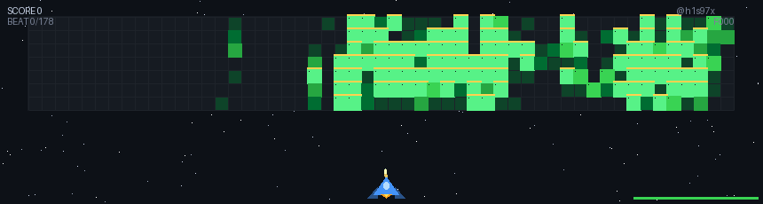

<!--
**h1s97x/h1s97x** is a ✨ _special_ ✨ repository because its `README.md` (this file) appears on your GitHub profile.
-->

---

  
🚀 点击开启我的 GitHub 太空射击小游戏

   
  

    
  

  

    你的 GitHub 贡献图就是外星人基地 — 打得越多，敌人越强！
  

